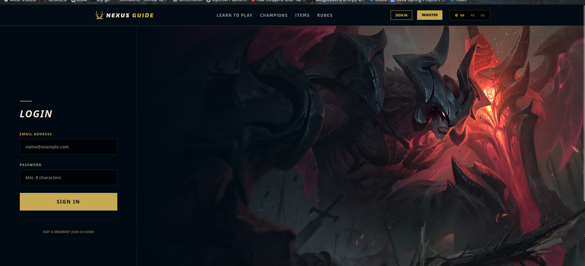
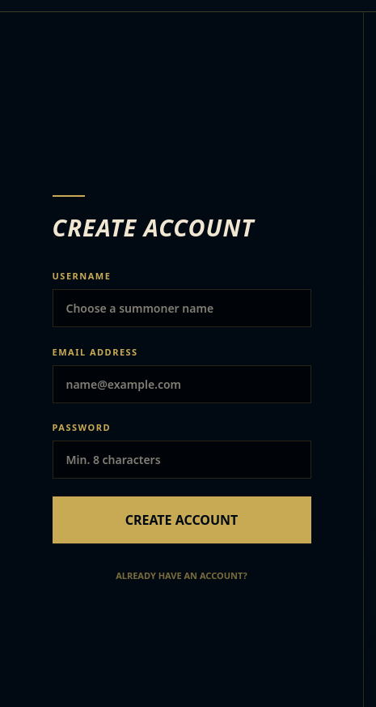
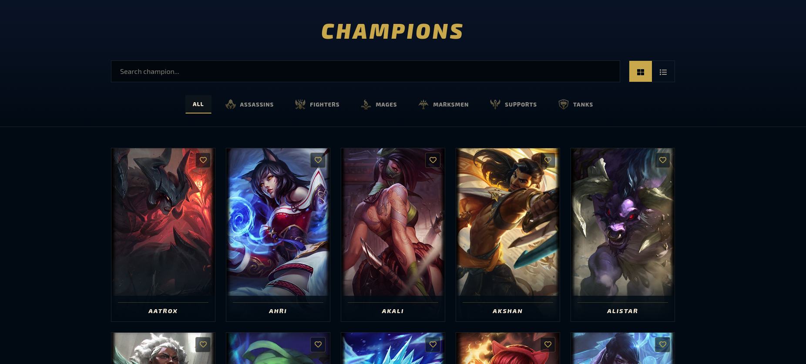
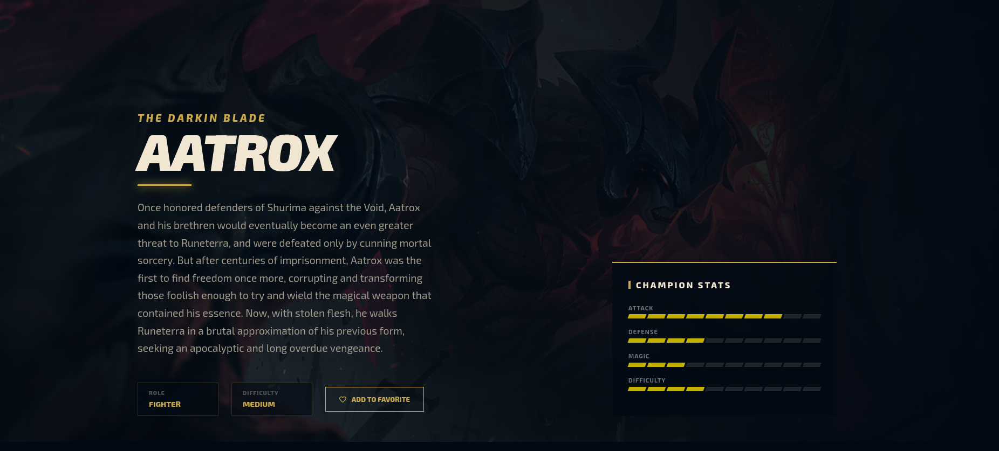
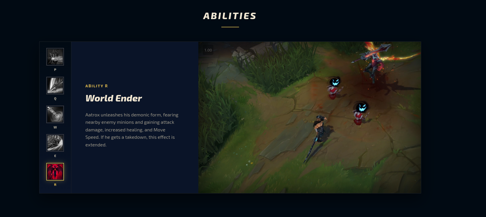
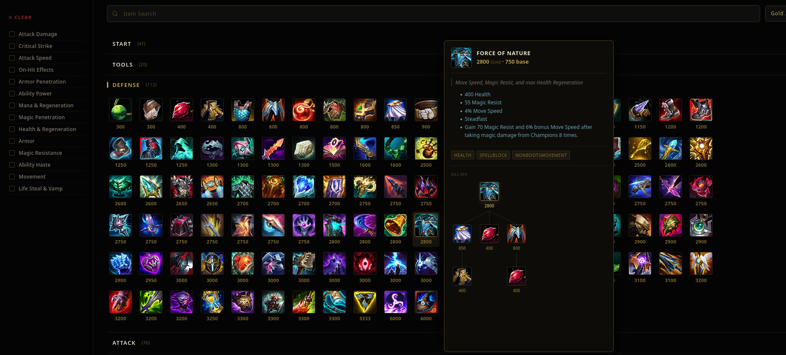
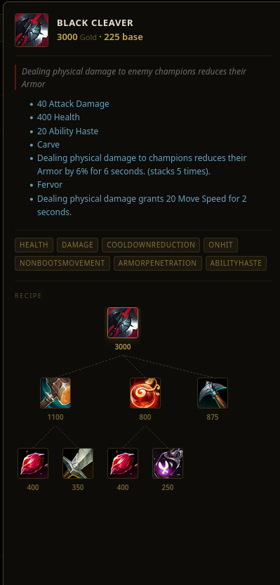
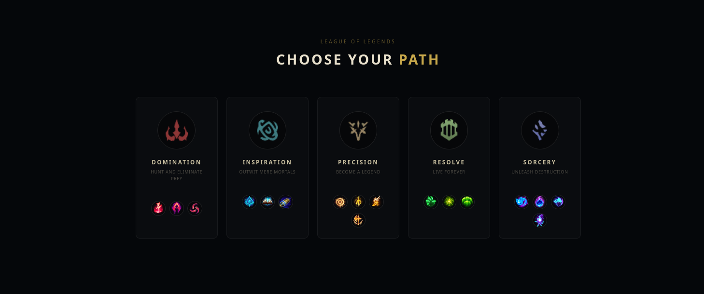
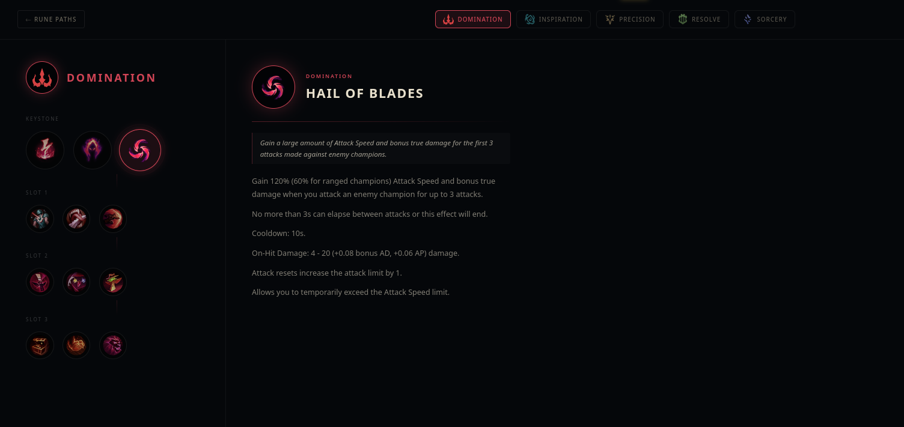

# 🏆 League of Legends WIKI - University project 

An advanced web platform developed for exploring the League of Legends ecosystem, using real-time data from the Data Dragon API. The project focuses on performance, scalability, and an immersive user experience (UX), faithful to the Riot Games visual style.

---

## 📸 Visual Presentation (Screenshots)

### 🔐 Authentication & Security
*Secure access interface with dynamic backgrounds (Aatrox/Yasuo) and real-time validations.*
| Authentication | Create account |
| :---: | :---: |
|  |  |
| *Logic: UserContext & Session persistence.* | *Logic: Input validation and labels in multiple languages.* |

### ⚔️ Champion Universe
*Complex filtering and visualization system for champion data.*
| Champion Gallery | Details & Lore |
| :---: | :---: |
|  |  |
| *Adaptive Grid: col-xl-5 with LoL card aspect ratio.* | *Dynamic Rendering: Skills, Skins, and Stats.* |

| Champion Abilities | Champion Skins |
| :---: | :---: |
|  |  |
| *Dynamic Rendering: Abilities.* | *Dynamic Rendering: Skins.* |

### 🛠️ Gear & Strategy (Item Shop)
*The most complex section, including recipe trees and URL synchronization.*
| Item Shop | Recipe Tree and Popover |
| :---: | :---: |
|  |  |
| *Advanced Filtering: useSearchParams & Accordion.* | *SVG Render: foreignObject for build-tree.* |

### 💎 Runes
*Complex Section, including all Runes tree.*
| Runes Page | Runes Path Page |
| :---: | :---: |
|  | |
| *Runes Maping.* | *Dynamic Section Rendering: Runes tree.* |

---

## 🛠️ Tech Stack & React Concepts

### ⚛️ Frontend Architecture
* **Functional Components & Hooks**: Modern implementation based solely on Hooks (`useState`, `useEffect`, `useRef`).
* **Advanced Memoization**: Using `useMemo` and `useCallback` to stabilize function references and prevent costly re-renders in lists of 160+ champions.
* **Context API**: Centralized state management for:
* `UserContext`: Authentication, favorites management.
* `LanguageContext`: Custom system for switching between RO/EN.
* `ChampContext`: Custom system for data fetching and caching for best practices.

### 🎨 Design and UI (Hextech aesthetic)
* **Dynamic CSS Injection**: Use of the `dangerouslySetInnerHTML` method to keep styles atomic and isolated inside components.
* **League UI System**: Implementation of brand colors: **Hextech Gold (#c8aa55)** and **Deep Navy (#010a13)**.
* **Responsive Grid**: Flexible column system (Bootstrap + Custom CSS) that maintains LoL card proportions regardless of resolution.

### ⚙️ Detailed Business Logic
* **Stateful URL Filtering**: Search filters (tags, sorting, query) are synchronized directly in the URL via `useSearchParams`, allowing page state to be saved.
* **Build Tree Algorithm**: Recursive algorithm for building the object hierarchy in `ItemPopover`, using a lookup map for $O(1)$ performance.
* **Accordion Logic**: Using dynamic `scrollHeight` via `useRef` for smooth animations of opening/closing object categories.

---

## 🧠 Project Details & Development Environment

* **Data Source**: Integration with the Dragon Data (Riot Games) JSON format for version agnostic data.
* **Workflow**: Developed on **Fedora Linux** using **VSCODE** for maximum productivity in the JavaScript system.
* **Standards**: The code follows the principles of **DRY (Don't Repeat Yourself)** and **KISS (Keep It Simple, Stupid)**.

---

## 👤 Author

**Radu Pavlovschii**
*Information Technology Student & Junior React Dev*

---
